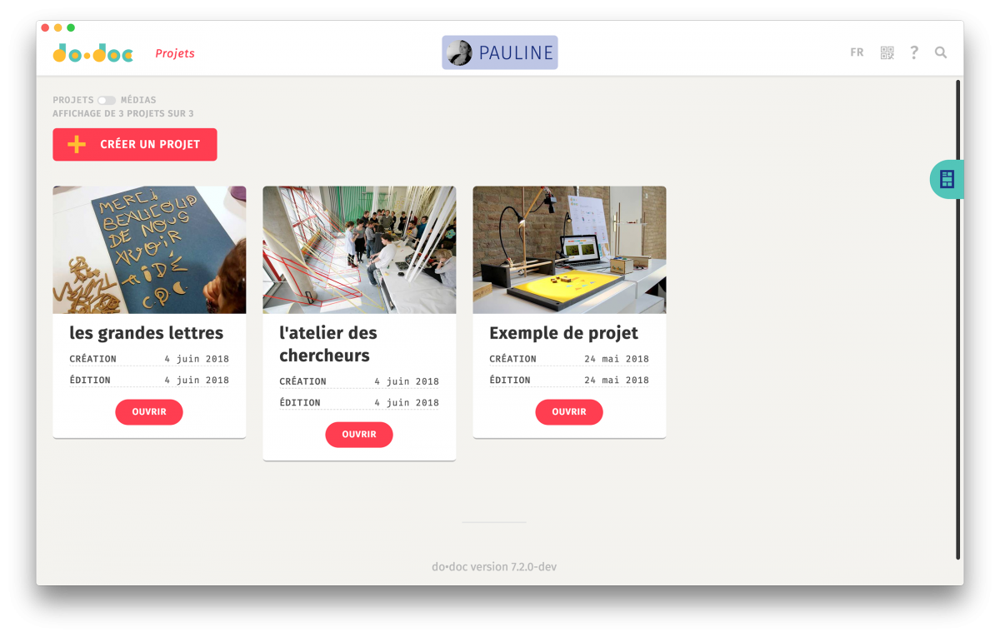

<!--
N.B.: README ini dibuat secara otomatis oleh <https://github.com/YunoHost/apps/tree/master/tools/readme_generator>
Ini TIDAK boleh diedit dengan tangan.
-->

# do•doc untuk YunoHost

[](https://ci-apps.yunohost.org/ci/apps/dodoc/)  

[](https://install-app.yunohost.org/?app=dodoc)

*[Baca README ini dengan bahasa yang lain.](./ALL_README.md)*

> *Paket ini memperbolehkan Anda untuk memasang do•doc secara cepat dan mudah pada server YunoHost.*  
> *Bila Anda tidak mempunyai YunoHost, silakan berkonsultasi dengan [panduan](https://yunohost.org/install) untuk mempelajari bagaimana untuk memasangnya.*

## Ringkasan

Designed to document and create stories from hands-on activities, do•doc (pronounced doudoc) is a composite, open-source, modular tool that allows you to capture media (photos, videos, sounds, and stop-motion), edit them, lay them out, and publish them. Its composite aspect allows it to be reconfigured so that it is as adapted as possible to the situation in which it is deployed.

**Versi terkirim:** 11.1.3~ynh2

**Demo:** <https://test.dodoc.fr/>

## Tangkapan Layar



## Dokumentasi dan sumber daya

- Website aplikasi resmi: <https://dodoc.fr/>
- Dokumentasi admin resmi: <https://github.com/l-atelier-des-chercheurs/dodoc#readme>
- Depot kode aplikasi hulu: <https://github.com/l-atelier-des-chercheurs/dodoc>
- Gudang YunoHost: <https://apps.yunohost.org/app/dodoc>
- Laporkan bug: <https://github.com/YunoHost-Apps/dodoc_ynh/issues>

## Info developer

Silakan kirim pull request ke [`testing` branch](https://github.com/YunoHost-Apps/dodoc_ynh/tree/testing).

Untuk mencoba branch `testing`, silakan dilanjutkan seperti:

```bash
sudo yunohost app install https://github.com/YunoHost-Apps/dodoc_ynh/tree/testing --debug
atau
sudo yunohost app upgrade dodoc -u https://github.com/YunoHost-Apps/dodoc_ynh/tree/testing --debug
```

**Info lebih lanjut mengenai pemaketan aplikasi:** <https://yunohost.org/packaging_apps>
