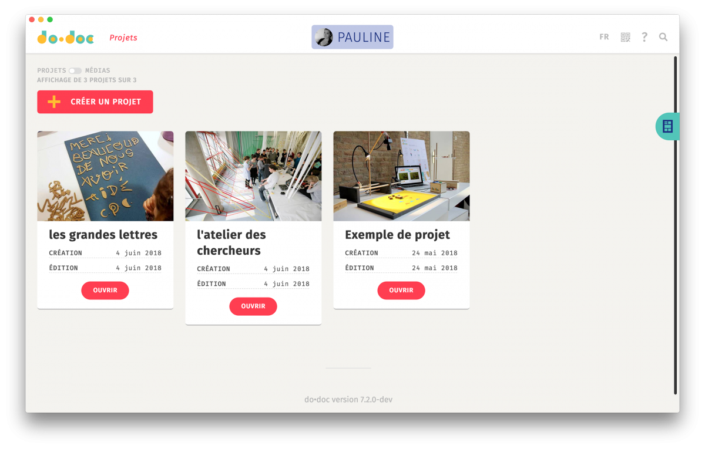

<!--
To README zostało automatycznie wygenerowane przez <https://github.com/YunoHost/apps/tree/master/tools/readme_generator>
Nie powinno być ono edytowane ręcznie.
-->

# do•doc dla YunoHost

[](https://ci-apps.yunohost.org/ci/apps/dodoc/)


[](https://install-app.yunohost.org/?app=dodoc)

*[Przeczytaj plik README w innym języku.](./ALL_README.md)*

> *Ta aplikacja pozwala na szybką i prostą instalację do•doc na serwerze YunoHost.*  
> *Jeżeli nie masz YunoHost zapoznaj się z [poradnikiem](https://yunohost.org/install) instalacji.*

## Przegląd

Designed to document and create stories from hands-on activities, do•doc (pronounced doudoc) is a composite, open-source, modular tool that allows you to capture media (photos, videos, sounds, and stop-motion), edit them, lay them out, and publish them. Its composite aspect allows it to be reconfigured so that it is as adapted as possible to the situation in which it is deployed.

**Dostarczona wersja:** 11.1.20~ynh2

**Demo:** <https://test.dodoc.fr/>

## Zrzuty ekranu



## Dokumentacja i zasoby

- Oficjalna strona aplikacji: <https://dodoc.fr/>
- Oficjalna dokumentacja dla administratora: <https://github.com/l-atelier-des-chercheurs/dodoc#readme>
- Repozytorium z kodem źródłowym: <https://github.com/l-atelier-des-chercheurs/dodoc>
- Sklep YunoHost: <https://apps.yunohost.org/app/dodoc>
- Zgłaszanie błędów: <https://github.com/YunoHost-Apps/dodoc_ynh/issues>

## Informacje od twórców

Wyślij swój pull request do [gałęzi `testing`](https://github.com/YunoHost-Apps/dodoc_ynh/tree/testing).

Aby wypróbować gałąź `testing` postępuj zgodnie z instrukcjami:

```bash
sudo yunohost app install https://github.com/YunoHost-Apps/dodoc_ynh/tree/testing --debug
lub
sudo yunohost app upgrade dodoc -u https://github.com/YunoHost-Apps/dodoc_ynh/tree/testing --debug
```

**Więcej informacji o tworzeniu paczek aplikacji:** <https://yunohost.org/packaging_apps>
